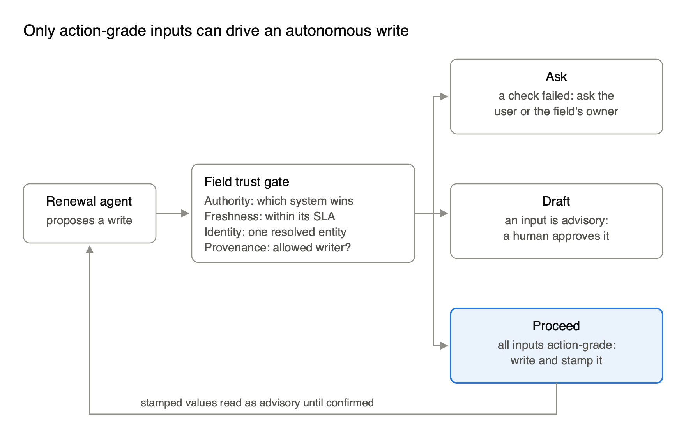
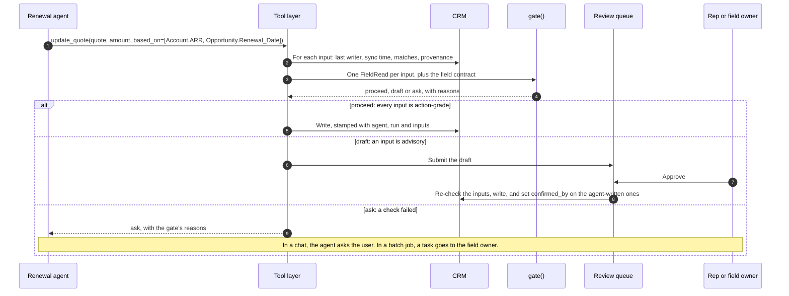
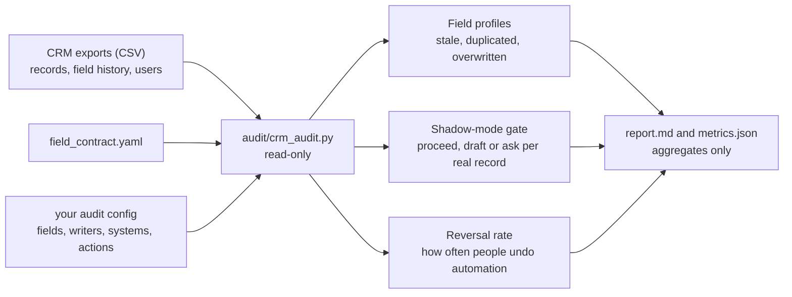
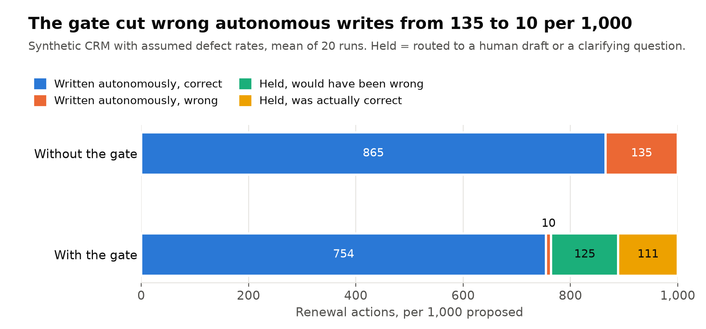
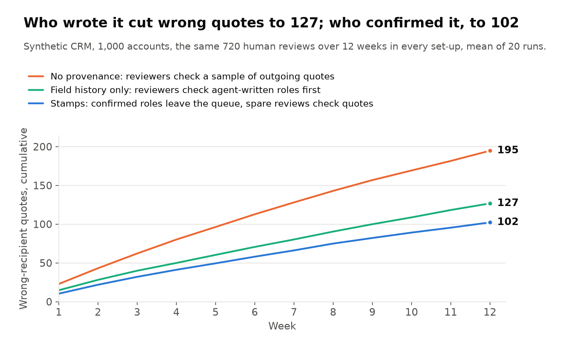

# crm-field-trust-gate


**Decide, field by field, what an AI agent may act on in your CRM, and measure it on your own data.**

A vendor-neutral pattern for AI agents that write to a CRM: a trust contract for each field the agent touches, a gate in the agent's tool layer that enforces it, and provenance on every agent write. With it, a read-only audit that shows which of your CRM fields an agent could act on today.



## Why

- **Stored in the CRM does not mean true.** Each CRM field has its own authority (billing, a contract system, a scoring model, a rep), its own freshness and its own writers, yet the API returns them all the same way.
- **Read-safe is not act-safe.** A wrong answer is a sentence a person can ignore. A wrong write is a quote, a renewal or a forecast that other systems then copy.
- **Agent writes feed back.** Without provenance, tomorrow's agent reads today's agent's guess as a fact a person confirmed.

## Quick start

Needs Python 3.10 or newer.

```bash
python3 -m venv .venv && source .venv/bin/activate     # Windows: .venv\Scripts\activate
python -m pip install -r requirements.txt
python examples/renewal_agent.py   # the pattern end to end, on a toy CRM
python -m pytest -q tests          # 43 tests
```

| I want to | Start here |
| --- | --- |
| Put the gate in front of my agent's writes | [Use the pattern](#use-the-pattern) |
| Use it in Salesforce with Agentforce | [On Salesforce and Agentforce](#on-salesforce-and-agentforce) |
| Find out which of my CRM fields an agent can trust today | [Measure your org](#measure-your-org) |
| Check the numbers behind the article | [Reproduce the simulations](#reproduce-the-simulations) |

## How it works

- **Contract** ([`field_contract.yaml`](field_contract.yaml)). For each field the agent touches: the system that is authoritative for it, how old a value may be before it should not drive an action, who may write it, and a tier. *Context* fields may be read but never drive a write, *advisory* fields may inform a draft a person approves, and *action-grade* fields may drive an autonomous write. [`contract.py`](contract.py) checks the contract for mistakes, such as a misspelled tier, before anything relies on it.
- **Gate** ([`gate.py`](gate.py)). Each write tool declares the fields its write is based on. For every input the gate checks authority, freshness, identity (exactly one matching record) and the last writer, then returns `proceed`, `draft` or `ask` with its reasons. A write inherits the lowest tier among its inputs, and a field with no contract fails.
- **Provenance** (`stamp()` in [`gate.py`](gate.py)). Every agent write carries the agent, the run, its inputs and whether anyone confirmed it, which field history alone cannot record. A value an agent wrote reads as advisory until a person confirms it.

## Use the pattern

[`examples/renewal_agent.py`](examples/renewal_agent.py) puts the gate in the tool layer of a renewal agent, on a tiny in-memory CRM. The tool layer builds a `FieldRead` for each declared input from the CRM's metadata, asks `gate()`, and fails closed if the gate raises. One write skips the gate on purpose: filling a blank contact role from an email signature, which is not a CRM field. The contract must list the agent as a writer for that field, and the stamp keeps the value advisory until a person confirms it. Approval lives in a separate review queue the agent cannot call. It re-checks the inputs before it applies a draft, and refuses a draft whose field someone changed in the meantime.



```text
$ python examples/renewal_agent.py
1. Update quote-1 from billing ARR and the contract renewal date
   -> proceed
2. Update quote-2 from ARR a rep typed, on a duplicated account
   -> ask
      Account.ARR: authority is billing, not crm
      Account.ARR: older than its SLA
      Account.ARR: 2 records match, expected 1
      Account.ARR: last written by sales_rep
3. Fill a blank contact role, inferred from an email signature
   -> written
4. Send quote-1 to that contact
   -> draft
      lowest input tier is advisory
5. A rep reviews the draft and approves it
   -> approved
6. Next run: send quote-3 to the same contact
   -> proceed
7. Update quote-4 from ARR with a broken timestamp
   -> ask
      gate error: TypeError: can't subtract offset-naive and offset-aware datetimes

Contact.Role provenance: written by agent:renewal from email signature, confirmed by sales_rep
```

Steps 1, 4 and 2 show the three outcomes: proceed, draft and ask. Step 6 is the feedback loop closing: once a person confirms the agent's guess, the next read reports the confirmer as last writer and the role is action-grade again.

### Behind an MCP server

[`examples/mcp_server.py`](examples/mcp_server.py) puts the same tool layer behind an [MCP](https://modelcontextprotocol.io) server, so any MCP-capable agent can call the gated tools: `update_renewal_quote`, `send_quote` and `set_contact_role`. The tool, not the model, declares the fields each write depends on, so the model cannot leave an input out to get past the gate. Approval is not a tool: the agent can read its pending drafts (`drafts://pending`) but never approve them. Each tool returns `decision` and `reasons`, and carries annotations that tell the client whether it changes data or reaches outside, so the client can ask the user before running it.

Most MCP clients take a config like this:

```json
{
  "mcpServers": {
    "crm-field-trust-gate": {
      "command": "/path/to/crm-field-trust-gate/.venv/bin/python",
      "args": ["/path/to/crm-field-trust-gate/examples/mcp_server.py"]
    }
  }
}
```

[`tests/test_mcp.py`](tests/test_mcp.py) drives it the same way, with a real MCP client over stdio.

### On Salesforce and Agentforce

[`salesforce/`](salesforce/README.md) is the same pattern, native to Salesforce: the contract in Custom Metadata, the gate in Apex, and three Agentforce actions. The code, not the model, decides what each write is based on, and the inputs come from what the org already keeps (field history, sync timestamp fields, duplicate counts and a provenance object). The Apex gate gives exactly the same answers as `gate.py` on 404 generated cases. Drafts are approved by a person who holds a custom permission the agent's permission set does not grant.

[`salesforce/scripts/e2e.py`](salesforce/scripts/e2e.py) runs it on a real org with private sharing, a published Agentforce agent and live actions. The agent writes the quote on a clean renewal. It holds the one built on ARR a rep typed over, with the gate's four reasons, one of them a duplicate account the agent cannot see. It drafts the send that rests on its own guess, sends straight through once a person confirms the guess, and refuses a contact from another company. Every step is checked against the records.

### In your own CRM

`FieldRead` is the only interface the gate needs. In a real CRM you populate it from:

- `source_system`: map the last writer (an integration user per upstream system) to a system name. Map an agent to the system it writes into, usually the CRM, so that on a CRM-owned field it is allowed to write, its values come back as drafts rather than authority failures.
- `last_synced`: a sync timestamp field the integration sets on every run, even when the value did not change.
- `last_writer`: field history, or your provenance record for agent writes. Once a person confirms an agent's value, report the confirmer.
- `matches`: your duplicate and matching rules for the entity.

## Measure your org

The audit turns a few CSV exports from your CRM into real, aggregate numbers: how stale, duplicated and overwritten each field is, how often people undo automated writes, and what share of real records the gate would let an agent act on today. It runs the gate in shadow mode, so nothing is written anywhere. The audit itself never connects to your CRM.



Try it on the bundled fake org first. [`audit/example_report.md`](audit/example_report.md) shows what it produces.

```bash
python audit/make_sample_data.py
python audit/crm_audit.py --config audit/sample_config.yaml --out reports/sample
```

On Salesforce, `audit/export_salesforce.sh <org-alias>` exports the five CSVs in one go. Read [audit/README.md](audit/README.md) before running it on a work org: get permission, use a sandbox, and publish only rounded aggregates.

## Reproduce the simulations

Two simulations on a synthetic CRM put numbers on the trade-off: what the gate catches and what it costs, and what provenance changes when an agent's own guesses feed back into the CRM.

```bash
python simulate.py                 # writes results/*.csv and results/summary.json
python figures.py                  # Figures 3 and 4
python diagrams.py                 # Figures 1 and 2 (needs the native Cairo library)
```

`diagrams.py` needs Cairo (`brew install cairo` on macOS, `apt install libcairo2` on Debian or Ubuntu); everything else is pure pip. Results are deterministic: 20 fixed seeds, mean reported. `results/summary.json` holds every headline number, including the robustness checks (reviewers who catch 90% of errors, metadata that reveals 80% of defects, both together, and the same reviews spent at random).

The committed `results/` and `figures/` were produced with Python 3.12.15 and numpy 2.5.3, and `results/` comes out byte for byte the same with Python 3.10 and the oldest versions `requirements.txt` allows (numpy 1.26.0, pandas 2.2.2); CI checks both on every push. NumPy does not promise identical random streams across versions, so if your numbers differ, install `requirements-lock.txt` (Python 3.12 or newer) instead of `requirements.txt`. `figures.py` and `diagrams.py` overwrite `figures/`, and other library versions draw slightly different PNG bytes; `git checkout figures/` restores the committed ones.

Everything is synthetic. The defect rates in `simulate.py` (`ASSUMED_RATES`, `LOOP`) are **assumptions**, not measurements from any real org. Replace them with rates you measure with the audit. The useful output is the shape of the trade-off, not the exact numbers:

- **Experiment 1:** a renewal agent proposes 1,000 quote updates. Without the gate, every write executes. With the gate, writes built on stale, duplicated, overwritten or agent-written inputs are held for a human or a clarifying question. The gate cannot see errors that arrive with clean metadata (the `upstream_wrong` case), and it holds some correct writes, which costs human time. By construction it catches every defect marked visible, so the run where metadata reveals only 80% of defects is the real test. The share of late syncs that changed nothing (6%) is an input, so the cost of those false alarms is assumed, not measured. `results/exp1_sensitivity.csv` shows how both effects scale as defect rates rise.
- **Experiment 2:** an agent fills in missing contact roles by inference and later sends quotes to those contacts. Every set-up gets the same weekly review budget. Without provenance, reviewers either audit stored values at random or check a sample of outgoing quotes. With field history only (`history_only`), the agent writes as its own integration user, so reviewers check the roles it wrote first; with no confirmation record, a role they approved unchanged still looks agent-written. With stamps, every send goes through `gate()`: unconfirmed guesses become drafts reviewed first, confirmed ones leave the queue, and leftover budget checks outgoing quotes. Every contact role is assumed to be within its freshness SLA. `summary.json` also reports quotes sent per set-up and wrong sends per 1,000 sent; `results/exp2_sensitivity.csv` varies the agent's accuracy.





## What is in the repo

| File | What it is | Explained in the article under |
| --- | --- | --- |
| `field_contract.yaml` | The trust contract for each field the agent touches | The field trust contract |
| `contract.py` | Loads a contract and reports mistakes in it | |
| `gate.py` | `gate()`, called before any write, and `stamp()`, which attaches provenance | The field trust contract; The feedback loop nobody budgets for |
| `examples/renewal_agent.py` | The pattern end to end: declared inputs, the gate, drafts, confirmation | The field trust contract; Where the gate's inputs come from |
| `examples/mcp_server.py` | The same tools behind an MCP server, for any MCP-capable agent | |
| `salesforce/` | The pattern native to Salesforce: Custom Metadata contract, Apex gate, Agentforce actions, Apex tests and an end-to-end test | |
| `audit/` | The read-only audit of your own CRM exports, with the gate in shadow mode | Where the gate's inputs come from; Run it yourself |
| `simulate.py`, `results/` | The two simulations and every number they produce | Does it help? A simulation you can rerun; The feedback loop nobody budgets for |
| `figures.py`, `diagrams.py`, `figures/` | Figures 3 and 4; Figures 1 and 2 | Figures 1 to 4 |
| `tests/` | 43 tests: the contract, the gate, the examples, the audit and the Salesforce parity checks | |

## Limits

- **Errors with clean metadata.** If the authoritative system itself holds the wrong value, every check passes. The gate points trust at the right source but cannot make that source correct.
- **Human-entered errors.** A rep who types the wrong value leaves one that looks authoritative.
- **Permissions and prompt injection.** The gate judges whether data is fit to act on, not whether the agent may act or whether its instructions were tampered with. You still need least-privilege identities and input controls.
- **Contract upkeep.** Contracts drift when integrations change. Version them, review them like code, and alert when a touched field has no contract.
- **Platform limits.** Field history has caps, retention limits and field types it captures poorly. Check them for the fields that matter.

## How to cite

If this work helps yours, please cite it ([Himanshu Palerwal, ORCID 0009-0004-1752-2857](https://orcid.org/0009-0004-1752-2857)), with the version you used. The **Cite this repository** button on this page, generated from [`CITATION.cff`](CITATION.cff), gives APA and BibTeX. A citation for the article will be added here once it is published.

```bibtex
@misc{palerwal2026gate,
  author       = {Palerwal, Himanshu},
  title        = {crm-field-trust-gate},
  note         = {Version 1.0.0},
  year         = {2026},
  howpublished = {\url{https://github.com/himanshupalerwal/crm-field-trust-gate}}
}
```

## Author

**Himanshu Palerwal** -- 18x Salesforce Certified | Post Sales Technical Architect

- 15 years in the Salesforce ecosystem
- Currently at **ServiceTitan** -- Post Sales Technical Architect
- Previously at **JPMorgan Chase** and **Bank of America** -- App Owner & Technical Architect
- Specializing in Apex, LWC, Enterprise Architecture, AI Agents, MCP, and Agentic Architecture at enterprise scale
- LinkedIn: [linkedin.com/in/himanshupalerwal](https://linkedin.com/in/himanshupalerwal)
- GitHub: [github.com/himanshupalerwal](https://github.com/himanshupalerwal)
- ORCID: [0009-0004-1752-2857](https://orcid.org/0009-0004-1752-2857)

This is personal work. It is not affiliated with or endorsed by ServiceTitan, and it uses no ServiceTitan data: everything in this repo is synthetic.

## License

MIT
