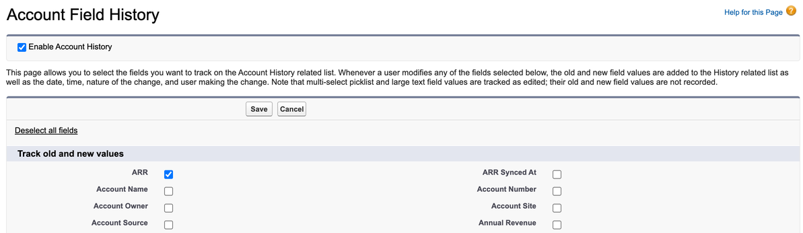
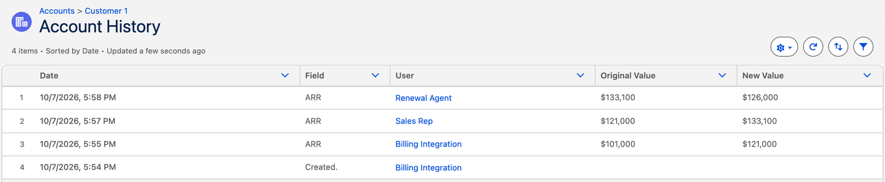

# Measure your own CRM: the field trust audit

`crm_audit.py` turns a few CSV exports from your CRM into real, aggregate numbers:
how trustworthy each field an agent would touch actually is, and what the gate would
do with your real records, in **shadow mode**, before any agent writes anything.

It is read-only. It never connects to your CRM. It reads CSV files on your machine and
writes a report of percentages and counts. No record ids, usernames, emails or field values
appear in the output; a test checks that no id, account name, username, email, website or
website domain from the input does.

## Try it on the fake sample org first

```bash
python audit/make_sample_data.py                     # writes audit/sample_data/*.csv (all invented)
python audit/crm_audit.py --config audit/sample_config.yaml --out reports/sample
```

Open `reports/sample/report.md`. On the sample org you will see, for example, that stale
ARR values disagree with billing about 42% of the time while fresh ones disagree about 3%.

## Before you run it on a work org

Read this first. It matters more than the code.

1. **Get permission.** Ask whoever owns the data (your manager, security or legal) before
   exporting, and again before publishing anything, even aggregate percentages.
2. **Prefer a sandbox copy** of production, and a read-only user.
3. **Export only what the config needs.** You do not need account names, contact names or
   emails. Leave them out of your queries.
4. **Keep exports out of git.** Put them in `data/` (ignored by `.gitignore`) and delete them
   when you are done. Reports go to `reports/`, also ignored.
5. **Publish rounded, anonymized numbers.** "About one renewal in five would have been held,
   mostly for stale renewal dates" is publishable. Exact counts, org size or field names that
   identify a customer or your company's setup may not be. Percentages over fewer than
   `min_group_size` records are suppressed automatically; counts are printed as they are, so
   round them before you share.

## What to export (Salesforce)

First, turn on Field History Tracking for each field the agent acts on (Setup, Object Manager,
the object, Fields & Relationships, Set History Tracking). History starts on the day you turn
it on.



From then on, every change records who made it. On this fake account, the billing integration
set ARR, a rep typed over it, and the renewal agent wrote it again: the mix of writers the
audit measures.



The quickest way to export is the script, which runs the five queries below with the
Salesforce CLI. Edit the field API names at its top first.

```bash
audit/export_salesforce.sh my-sandbox          # writes data/*.csv
```

To run a query yourself, with the CLI, Data Loader or Workbench, save each result as CSV in
`data/`. With the CLI:

```bash
sf data query --target-org my-sandbox --result-format csv \
  --query "SELECT Id, Website, ARR__c, ARR_Synced_At__c, LastModifiedDate FROM Account" \
  > data/accounts.csv
```

The CLI prints its own warnings to stderr, so redirecting with `>` gives a clean CSV. When a
query returns no rows, `sf data query` writes a single blank line and the bulk export writes
only the header. The audit reads either as "no history yet" for a history file, and stops on
any other file with no rows. The CLI caps a query at 10,000 records (the script stops if an
export hits the cap); above that, use the Bulk API with the same query. Its CSV gives the
audit identical results:

```bash
sf data export bulk --target-org my-sandbox --result-format csv --wait 10 \
  --output-file data/accounts.csv \
  --query "SELECT Id, Website, ARR__c, ARR_Synced_At__c, LastModifiedDate FROM Account"
```

The script, the five queries below and the bulk command were tested against a Salesforce
scratch org.

| File | Query |
| --- | --- |
| `data/accounts.csv` | `SELECT Id, Website, ARR__c, ARR_Synced_At__c, LastModifiedDate FROM Account` |
| `data/opportunities.csv` | `SELECT Id, AccountId, Type, Renewal_Date__c, LastModifiedDate FROM Opportunity WHERE Type = 'Renewal'` |
| `data/account_history.csv` | `SELECT AccountId, Field, CreatedById, CreatedDate FROM AccountHistory WHERE Field IN ('ARR__c')` |
| `data/opportunity_history.csv` | `SELECT OpportunityId, Field, CreatedById, CreatedDate FROM OpportunityFieldHistory WHERE Field IN ('Renewal_Date__c')` |
| `data/users.csv` | `SELECT Id, Username, Profile.Name FROM User` |

Notes:
- Custom objects store history in `YourObject__History`, with the record id in `ParentId`.
- History only exists for fields with Field History Tracking turned on, and only from the day
  it was turned on. Standard retention is 18 to 24 months. Records without history show up
  under "No field history", and the report says so.
- Usernames usually look like email addresses. They stay on your machine and never reach the
  report. If you would rather not export them, map users by Id (`by_user_id`) and drop
  `Username` from the query.
- `OldValue` and `NewValue` are not needed. Leaving them out keeps values out of your export.
- If you have no sync timestamp field yet, leave `sync_columns` out. Freshness then falls back
  to the last change in field history, which overstates staleness, or, with no history, to the
  record's last modified date, which can be wrong in either direction. The report flags both.
  That gap is itself a finding.
- Optional: an extract from the authoritative system (for example billing ARR by account id)
  lets the audit measure how often the CRM value is actually wrong, split by fresh vs stale.

## Configure it

Copy `audit/sample_config.yaml` to `audit/my_config.yaml` (git ignores it) and edit it. The
sample maps two columns the queries above leave out, `Health_Score__c` and
`Renewal_Synced_At__c`: export them too, or remove them from your copy. The audit stops with
a clear message if a mapped column is missing. Paths in the config are relative to the config
file, so from `audit/my_config.yaml` your exports are `../data/accounts.csv` and so on.

- `contract`: the field contract to check against. Start from `field_contract.yaml`.
- `fields`: contract field name -> object and column in your exports.
- `records`: one CSV per object; `match_key` counts duplicates; `sync_columns` maps a field to
  its sync timestamp column.
- `history`: your field history exports and their column names.
- `writers`: map integration users, agent users and profiles to writer labels such as
  `billing_sync`, `sales_rep` or `agent:renewal`. Giving each integration and agent its own
  user is what makes this possible. Users you do not map get the `default` label, and their
  changes are reported separately rather than counted as people.
- `systems`: which system each writer speaks for. Map an agent to the system it writes into,
  usually the CRM, as the sample config does.
- `actions`: the agent actions to simulate, their input fields, and how the primary object
  links to the others.

Then run:

```bash
python audit/crm_audit.py --config audit/my_config.yaml --out reports/my_org
```

## What the numbers mean

| Report section | What it tells you | Article metric |
| --- | --- | --- |
| Shadow-mode gate: decisions | Share of real actions the gate would let through, draft or hold today | Action-grade coverage, in practice |
| Shadow-mode gate: failed checks | Which check holds the most actions, and on which field | Hold rate by failed check |
| Field profiles: over SLA, writer not allowed, duplicates, blank | Your real defect rates, field by field | Inputs for `ASSUMED_RATES` in `simulate.py` |
| Mismatch against source of truth | How often the CRM value is actually wrong, fresh vs stale | Inputs for `ASSUMED_RATES` |
| Reversal rate | How often a person makes the next change to what an integration or agent wrote, within `reversal_window_days` (30 by default) | Reversal rate on agent writes |

Duplicates count every record that shares its match key with another, originals included.
The authority and writer checks usually fail together, because the audit derives each
value's source system from its writer.

The override rate on drafts needs an agent that produces drafts; log each draft and whether a
person changed it, and you can add it later.

To rerun the article's simulation with your numbers, copy the field profile rates into
`ASSUMED_RATES` in `simulate.py`: over-SLA share times the stale mismatch rate is
`stale_changed`, the rest of the over-SLA share is `stale_unchanged`, rep-written share is
`rep_override`, and so on.
